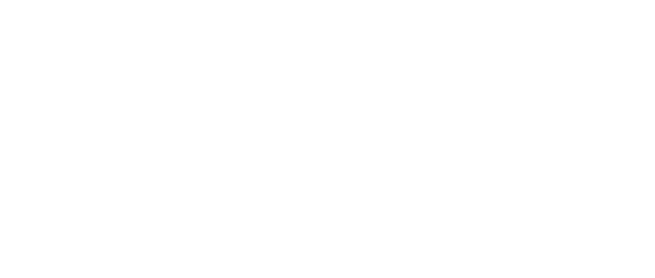
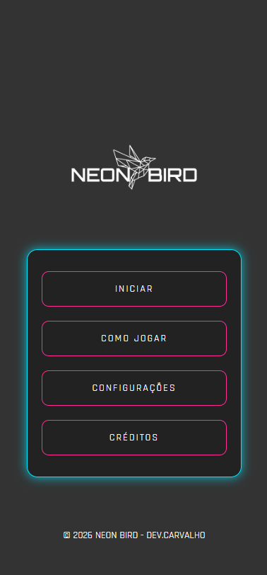
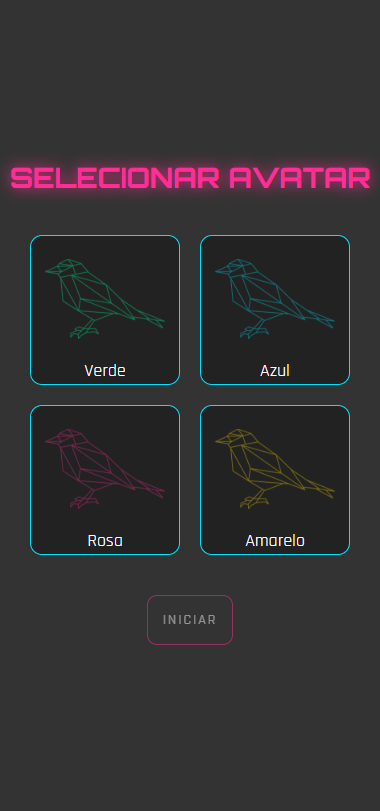
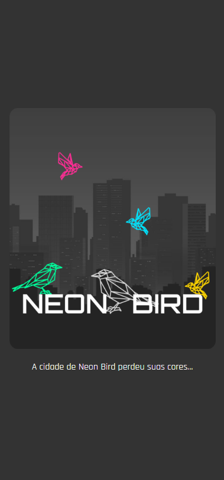
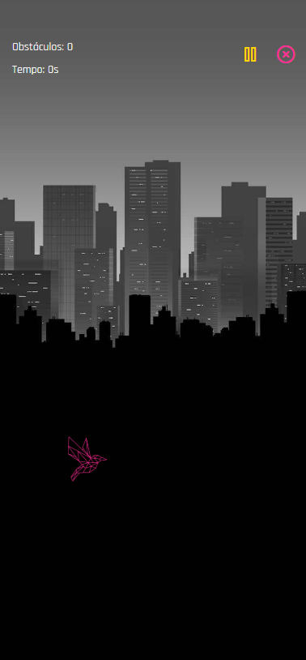

<div align="center">
    
</div>

**Neon Bird** é um jogo mobile inspirado no clássico estilo *Flappy Bird*, desenvolvido em **React Native + Expo**. O jogo propõe uma experiência dinâmica e imersiva, onde o jogador controla pássaros que precisam atravessar obstáculos e restaurar as cores de uma cidade. A aplicação conta com animações, efeitos sonoros, sistema de pontuação e telas interativas, oferecendo uma experiência envolvente e responsiva.

Este projeto foi desenvolvido para fins acadêmicos na disciplina de **Programação para Dispositivos Móveis II** do curso de **Desenvolvimento de Software Multiplataforma**.

[](https://snack.expo.dev/@debora-carvalho/neon-bird-app)

---

## Funcionalidades

* Seleção de personagem (pássaros)
* Tela de introdução com narrativa e efeito de digitação
* Gameplay estilo Flappy Bird com física personalizada
* Contador de tempo e obstáculos
* Sistema de pontuação e recorde
* Pausar, reiniciar e sair do jogo
* Efeitos sonoros (pulo, colisão, sucesso)
* Música de fundo controlável
* Tela de configurações (som e música)
* Interface moderna com tema neon

---

## Tecnologias utilizadas


## 📷 Screenshots

<div align="center">
    
    
    
    
</div>

<br />

## 👩🏽‍💻 Passos para executar

Você pode baixar este projeto em arquivo .zip, clicando no botão <b>Code</b>, ou então seguir os passos abaixo para clonar o repositório em seu dispositivo:

```bash
# Clone o repositório
$ git clone https://github.com/deboracarvalhodev/neon-bird-app.git

# Entre na pasta do projeto
$ cd neon-bird-app

# Instale as dependências
$ npm install
```
Executando pelo **Expo Go (dispositivo móvel)** 

- Instale o aplicativo Expo Go no seu celular (disponível na Google Play Store ou App Store). 

- No terminal, inicie o servidor do Expo: 

```bash
npm start
```

- Um QR code será exibido no terminal ou no navegador. 

- Abra o Expo Go no celular e escaneie o QR code. O aplicativo será carregado automaticamente no seu dispositivo. 

Executando pelo **Android Studio (emulador)** 

- Abra o Android Studio e crie um emulador Android (AVD) com a versão desejada do Android. 

- No terminal do projeto, execute: 

```bash
npm run android
```
- O projeto será compilado e aberto no emulador.

<br />

## Desenvolvedora

| [<br><sub>Débora Carvalho</sub>](https://github.com/Debora-Carvalho) |
| :---------------------------------------------------------------------------------------------------------------------------------------------------------------------------------------------: |
|                                                                [Linkedin](www.linkedin.com/in/debora-vieira-carvalho-45a478205)                                                                 |

📅 Última atualização: 2026

---

## Conceitos aplicados

* Gerenciamento de estado com Hooks (`useState`, `useEffect`, `useRef`)
* Criação de hooks customizados (`useGameLoop`, `useObstacles`)
* Manipulação de animações com `Animated`
* Controle de áudio com `expo-av`
* Estruturação de navegação com React Navigation
* Separação de responsabilidades (componentes, hooks, context)

---

## 📂 Estrutura do projeto

```bash
src/
 ├── assets/
 │    ├── birds/
 │    ├── sounds/
 │    └── images/
 │
 ├── components/
 │    ├── Bird.js
 │    ├── Obstacle.js
 │    └── Header.js
 │
 ├── screens/
 │    ├── HomeScreen.js
 │    ├── StoryScreen.js
 │    ├── SelectBirdScreen.js
 │    ├── GameScreen.js
 │    ├── SettingsScreen.js
 │    └── CreditsScreen.js
 │
 ├── game/
 │    ├── useGameLoop.js
 │    ├── useObstacles.js
 │    └── gameConstants.js
 │
 ├── context/
 │    └── AudioContext.js
 │
 ├── styles/
 │    ├── Estilo.js
 │    └── GameEstilo.js
 │
 └── routes/
      └── routes.js
```

---

## 📌 Observações

Este projeto é acadêmico e foi desenvolvido com fins educacionais.
Alguns comportamentos podem ser simplificados em relação a jogos comerciais.


